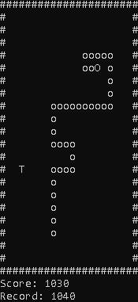
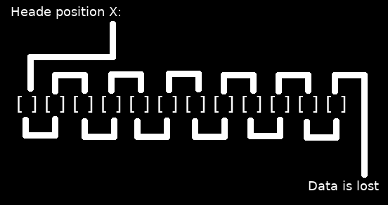
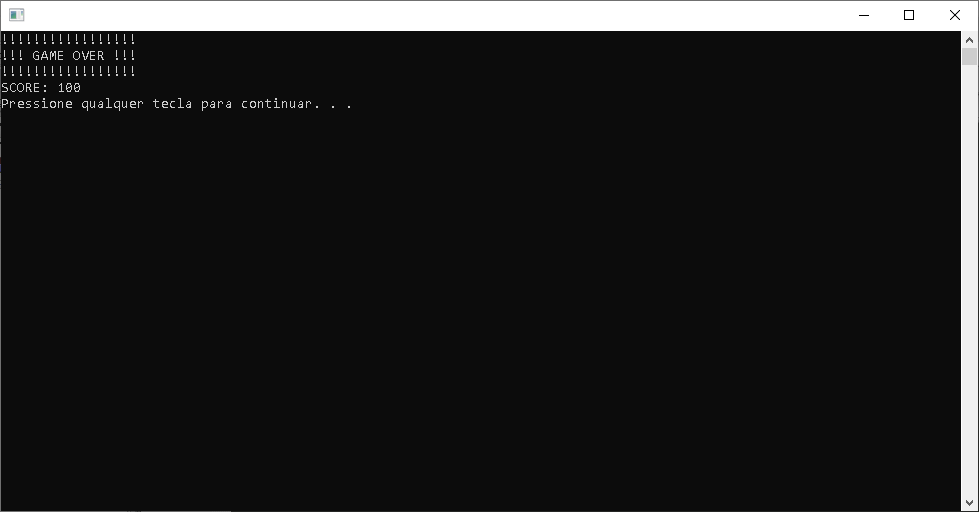
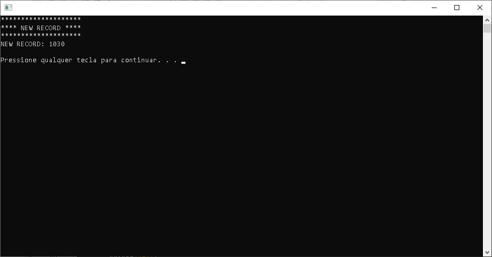

# Very simple snake game in C [Only for windows]

<p align="center">
  
</p>

## Whats is this code:

This is a version of the snake game made with C running in prompt. The code is not the best version or logic for this game. The focus is a simple code for beginners understand arrays and simple concepts of a game logic.

## Whats is need to run this code:

You only need a compiler for C/C++ whogameOver can compile for Windows. All header used in this project is standard headers on compilers for Windows.

## Explaining the code:

- The headres:
    - ```stdio.h```
    
    ```c
    // Funcrtion used of stdio.h
    int printf ( const char * format, ... );
    FILE * fopen ( const char * filename, const char * mode );
    size_t fread ( void * ptr, size_t size, size_t count, FILE * stream );
    int fclose ( FILE * stream );
    size_t fwrite ( const void * ptr, size_t size, size_t count, FILE * stream );
    ```
    - ```stdlib.h```
    ```c
    // Funcrtion used of stdlib.h
    int rand (void);
    void srand (unsigned int seed);
    void exit (int status);
    int system (const char* command);
    ```
    - ```conio.h```
    
    >Header only for windows
    ```c
    // Funcrtion used of conio.h
    kbhit()
    getch()
    
    ```
    - ```windows.h```
    
    >Header only for windows
    ```c
    // Funcrtion used of windows.h
    Sleep()
    
    ```
    - ```time.h```
    ```c
    // Funcrtion used of time.h
    time_t time (time_t* timer);
    
    ```
- Functions:
    ```c
    void setUp(); // read the record file and startup the variables
    void mapa(); // the output function, draw the map
    void entrada(); // the input function, read the keyboard without interruptions
    void logica(); // all the checks and logic of the game    
    ```
- Explain:

The only part of the code that may have difficulty understanding is the snake's tail.

The tail is divided into two matrices, with the maximum length being 399, a bit exaggerated. And we have a variable who tell the actual size of the tail.

To have the tail effect follow our movement, we use a 'bubblesort' to rearrange it every cycle of the game.

The logic is, the current position we're checking the tail, gets the position of your neighbor. The first position of the vector receives the position of the head, the second receives that of the first, the third that of the second, and so on.

<p align="center">
  
</p>

- In code:
```C
int posCalX,posCalY; 
int posSeguiCalX, posSeguiCalY;
```
These variables are auxiliary to a tail reorganization. 
```C
calX[0]=x;
calY[0]=y;
for(i=1;i<MAXCALDA;i++){ 
  posSeguiCalX = posCalX;
  posSeguiCalY = posCalY;
  posCalX=calX[i];
  posCalY=calY[i];
  calX[i]=posSeguiCalX;
  calY[i]=posSeguiCalY;
}
``` 

Before entering the loop, we take the x and y positions of the head. And we do the 'bubblesort'.


## Game Over Screen: 

<p align="center">
  
</p>

## New Record Screen: 

<p align="center">
  
</p>


## References:

[stdio.h](http://www.cplusplus.com/reference/cstdio/)

[stdlib.h](http://www.cplusplus.com/reference/cstdlib/)

[time.h](http://www.cplusplus.com/reference/ctime/)